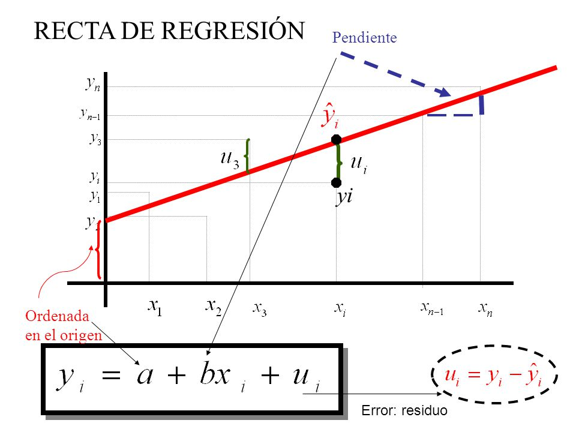
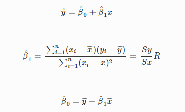
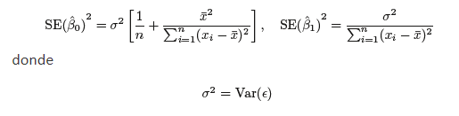
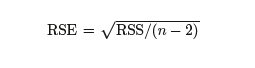
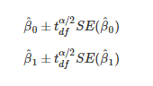
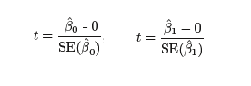
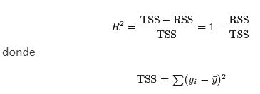
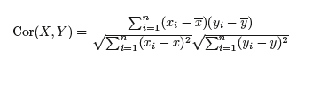

---

title: "REGRESIONES"
author: "Mayo y García"
date: "2022/08/06"
subtitle: Markdown - RMarkdown
output:
  html_document:
    code_download: TRUE

---

### **REGRESION LINEAL**

##### 
La correlación cuantifica cuan relacionadas están dos variables, mientras que la regresión lineal consiste en generar una ecuación (modelo) que, basándose en la relación existente entre ambas variables (Y, X), permite predecir el valor de una a partir de la otra. En las correlaciones no se consideran las dependencias, por su lado en las regresiones lineales, el modelo varía según que variable se considere dependiente de la otra (lo cual implica causa-efecto), por lo que además las regresiones nos permitirán predecir una variable a partir de otra. 
La regresión lineal simple consiste en generar un modelo de regresión (ecuación de una recta) que permita explicar la relación lineal que existe entre dos variables.

*Ejemplo. Podemos intentar predecir los niveles de estrés (Y = variable dependiente o respuesta) a partir del tiempo (X = v.  independiente) que falta para brindar una charla.*

*Si faltan 10 minutos para que una persona de una charla, qué grado de ansiedad tendrá? Se espera que la relación sea inversa (cuanto menos sea el tiempo hasta la charla, mayor será la ansiedad)*

#### Formula de regresion: 

$$ 
Y_t = B_0 + B_1*X_t + e_t
$$

##### 
A nivel experimental, en las correlaciones ninguna de las variables es controladas, mientras que en los estudios de regresión lineal es más común que una de las variables se controle y se mida la otra.

Siendo β0 la ordenada en el origen, β1 la pendiente y ϵ el error aleatorio. Este último representa la diferencia entre el valor ajustado por la recta y el valor real. Recoge el efecto de todas aquellas variables que influyen en Y pero que no se incluyen en el modelo como predictores. Al error aleatorio también se le conoce como residuo

##### ***Recta de regresion*** 

#####
En la regresión el modelo que ajustamos es lineal,lo que significa que resumimos un conjunto de datos con una línea recta. Para hacer predicciones precisas, queremos ajustar un modelo que describa mejor los datos. Cualquier línea recta puede definirse por dos cosas: (1) la pendiente (o gradiente) de la línea (normalmente denotada por β1); y (2) el punto en el que la línea cruza el eje vertical del gráfico (conocido como la intercepción de la línea, β0). Aquí β1 es el gradiente de la línea recta ajustada a los datos y β0 es la intersección de esa línea.

Donde: $$ a = β0 $$
       $$ b = β1 $$

#####
En la gran mayoría de casos, los valores β0 y β1 poblacionales son desconocidos, por lo que, a partir de una muestra, se obtienen sus estimaciones β^0 y β^1. Estas estimaciones se conocen como *coeficientes de regresión o least square coefficient estimates*, ya que toman aquellos valores que minimizan la suma de cuadrados residuales, dando lugar a la recta que pasa más cerca de todos los puntos. (Existen alternativas al método de mínimos cuadrados para obtener las estimaciones de los coeficientes).

#####
Donde Sy y Sx son las desviaciones típicas de cada variable y R el coeficiente de correlación. β^0 es el valor esperado la variable Y cuando X = 0, es decir, la intersección de la recta con el eje y. Es un dato necesario para generar la recta, pero en ocasiones, no tiene interpretación práctica (situaciones en las que X no puede adquirir el valor 0).

#####
*β0: representa el valor de Y cuando X = 0, mientras que β1 (Pendiente) incrementa en Y cuando X aumenta en una unidad.*

|   EDAD  | GLUCOSA |
|:-------:|:-------:|
|    0    |   0.12  |        
|    1    |   0.25  |        

#####
> "Explicación de la ecuación: Cuando tiene 0 años (x = 0), la glucosa es de 0.12 pasos y por año que cumpla (x = 1) la glucosa aumentará en un 0.25" 

#####
Una recta de regresión puede emplearse para diferentes propósitos y dependiendo de ellos es necesario satisfacer distintas condiciones. En caso de querer medir la relación lineal entre dos variables, la recta de regresión lo va a indicar de forma directa (ya que calcula la correlación). Sin embargo, en caso de querer predecir el valor de una variable en función de la otra, no solo se necesita calcular la recta, sino que además hay que asegurar que el modelo sea bueno.

### **INFERENCIA. PRECISION DE LOS COEFICIENTES DE REGRESION**

#####
Para estimar cómo de precisos son nuestros estimadores β0^ y β1^ y como, de media, difieren del valor de los verdaderos valores de los parámetros β0 y β1, calculamos el error estándar (SE) asociado con β0^ y β1^ se calcula con las siguientes ecuaciones:
#####

#####
La varianza del error ϵ es en general desconocida, pero se puede estimar a partir de los datos. Esta estimación es conocida como el error estándar residual (RSE), que no es más que la raíz cuadrada de la media de la suma de los residuos al cuadrado:

#####
*RSE* nos dará una estimación sobre la desviación promedio de cualquier punto respecto a la verdadera recta de regresión, o lo que es lo mismo, estima la desviación estándar de ϵ. *RSE* se divide entre los grados de libertad del modelo n – 2 (perdemos dos grados de libertad porque estimamos dos parámetros) para hacer este estimador insesgado.

#### ***Intervalo de confianza (CI)***

#####
A partir del cálculo del error estándar, podemos obtener los intervalos de confianza para cada uno de los estimadores. Un intervalo de confianza del 95% se definiría como el rango de valores tales que con un 95% de probabilidad, dicho rango contendría el verdadero parámetro poblacional desconocido. En el caso de la regresión lineal, este intervalo para β0 y β1 toma la siguiente forma:

#### ***Test de Hipótesis***

#####
El error estándar también puede usarse para llevar a cabo un test de hipótesis sobre los parámetros del modelo. El más común establece que

H0 : β1 = 0 (no existe relación entre X e Y)
Ha : β1 ≠ 0 (existe alguna relación entre X e Y)

#####
Para comprobar la hipótesis nula, necesitamos determinar si β1^ se aleja lo suficientemente de 0. La precisión con la que podemos determinar esto dependerá del SE(β1). Para ello llevamos a cabo un t-test, calculando el estadístico t, el cual mide el número de desviaciones estándar que el estimador β0^ y β1^ están del valor 0, y por último obtenemos el p-value:

#####
Si el p-value es menor que el nivel de significancia establecido, podemos deducir que hay una relación entre el predictor y la variable respuesta

#### ***Bondad de ajuste del modelo***

#####
En el caso de que la hipótesis nula sea rechazada, podemos cuantificar el grado con el que el modelo se ajusta a los datos. La calidad de un ajuste de regresión lineal es normalmente estimada usando dos valores relacionados: RSE y el estadístico o coeficiente de determinación R2, como fracción de la varianza explicada.

##### ***Error estándar residual (RSE)***
#####
El RSE, comentado anteriormente, se considera como una medida absoluta de la falta de ajuste del modelo a los datos, medido en las mismas unidades que Y. Cuanto más pequeño sea el valor del RSE, mejor se ajusta el modelo a los datos. Podemos calcular el % de error aproximado que el modelo comete en la predicción dividiendo el valor de RSE entre el valor promedio de la variable respuesta

##### ***Coeficiente de determinación***

#####
El coeficiente de determinación R2 constituye una alternativa al RSE. Toma un valor correspondiente a la proporción de variabilidad en Y explicada por el modelo en relación a la variabilidad total. Al corresponder a una proporción, tomará valores entre 0 y 1. Para calcular esta proporción, utilizamos la fórmula

#####
Un valor bajo podría indicar que el modelo lineal no es adecuado o podría deberse a errores residuales debido a variables no tenidas en cuenta. A diferencia del RSE, R2 es independiente de la escala de medida de Y, es decir, adimensional, por lo que presenta la ventaja de ser más fácil de interpretar.También podríamos decir que R2 es una medida de la relación linear entre X e Y, al igual que el coeficiente de correlación de Pearson (r), definida como:

#####
Únicamente en el caso de regresión lineal simple, se cumple que: R^2 = r^2

#### **CONDICIONES PARA LA REGRESION LINEAL** 

#####
**1.Linealidad:** la relación entre el predictor y la variable respuesta ha de ser lineal. Se puede comprobar mediante un diagrama de dispersión de los datos y el gráfico de los residuos.
**2.Distribución normal de los residuos:** los residuos deben distribuirse de forma normal, en torno a 0. Esta condición podría no cumplirse en presencia de observaciones atípicas o outliers que no siguen el patrón del conjunto de datos. Se puede comparar mediante un histograma de los datos, distribución de quantiles (normal Q-Q plot), test de hipótesis de normalidad
**3.Variabilidad de los residuos constante (homocedasticidad):** la variabilidad de los datos en torno a la recta de regresión ha de ser aproximadamente constante, lo cual implica que la variabilidad de los residuos debería ser constante también en torno a 0. Para ello se puede graficar los residuos y realizar el test de Breusch-Pagan.

>"¿Qué es la prueba de Breusch-Pagan?
La prueba de Breusch-Pagan se utiliza para determinar si la heteroscedasticidad está presente o no en un modelo de regresión. La prueba utiliza las siguientes hipótesis nulas y alternativas :
-Hipótesis nula (H0 ): la homocedasticidad está presente (los residuos se distribuyen con la misma varianza)
-Hipótesis alternativa (HA ): Heteroscedasticidad está presente (los residuos no se distribuyen con la misma varianza). Si el valor p de la prueba es menor que algún nivel de significancia (es decir, α = .05), entonces rechazamos la hipótesis nula y concluimos que la heterocedasticidad está presente en el modelo de regresión"

**4.Independencia:** las observaciones han de ser independientes unas de otras. Tener en cuenta en el caso de mediciones temporales. Se puede comprobar graficando los residuos y estudiar si siguen un patrón o tendencia.

#### **PASOS PARA REALIZAR UN ANALISIS DE REGRESION**

#####
1. Análisis exploratorio de los datos (como identificar outliers y normalizar la data)
2. Calculo del modelo de regresión lineal
3. Hallar los intervalos de confianza para los parámetros del modelo
4. Representación gráfica del modelo
5. Verificar condiciones para aceptar el modelo Uso del modelo para predecir nuevas observaciones

### **REFERENCIAS**
#####
https://www.cienciadedatos.net/documentos/24_correlacion_y_regresion_lineal.html#Regresi%C3%B3n_lineal_simple 
https://rpubs.com/Cristina_Gil/Regresion_Lineal_Simple 
https://statologos.com/prueba-pagana-breusch/#:~:text=La%20prueba%20de%20Breusch%2DPagan%20se%20uiliza%20para%20determinar%20si,distribuyen%20con%20la%20misma%20varianza 

