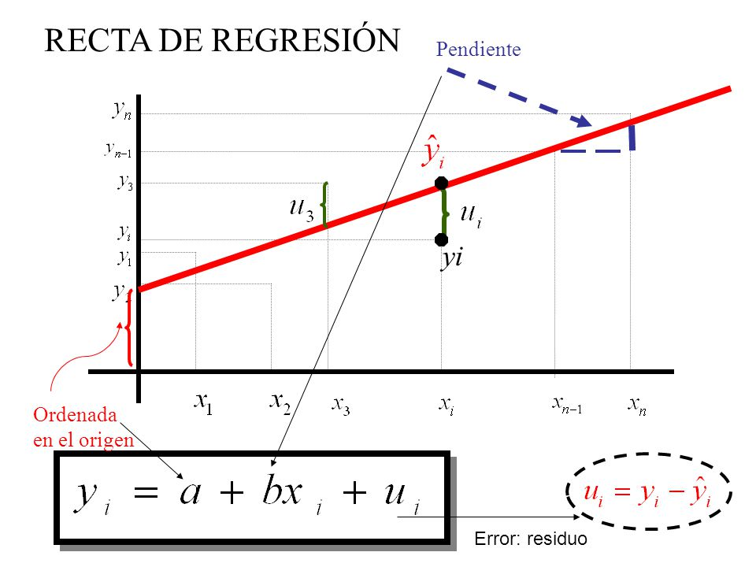

---

title: "REGRESIONES"
author: "Grupo Ciencia de datos"
subtitle: Markdown - RMarkdown
output:
  html_document:
    code_download: TRUE

---

## **REGRESION LINEAL SIMPLE - TEORÍA**

#####
La regresión lineal simple describe la *relación entre dos variables* como una línea, permitiendo predecir
el valor de una a partir de la otra. 

*Por ejemplo, podemos intentar predecir los niveles de estrés a partir del tiempo que falta para brindar una charla. Si solo* ***faltan 10 minutos*** *para que una persona de una charla, ¿ qué* ***grado de ansiedad*** *tendrá?* **Se espera que la relación sea inversa (cuanto menos sea el tiempo hasta la charla, mayor será la ansiedad)**


#####
En una regresión lineal simple resumimos un conjunto de datos en una linea recta para hacer predicciones precisas. 

La linea recta se crea a partir de una ecuación, que está conformada por (1) el intercepto, que es el punto en el que la línea cruza el eje vertical, denotada por β0), (2) la  pendiente de la línea, denotada por β1, 3) el error aleatorio ϵ o residuo que representa la diferencia entre el valor ajustado por la recta y el valor real, 4) la variable dependiente "y" y 5) la variable independiente "x".

En una regresión lineal simple tanto la variable dependiente (y) como independiente (x) deben ser continuas. 


$$ 
Y_t = B_0 + B_1*X_t + e_t
$$

<center>

</center>

Donde: $$ a = β0 $$
       $$ b = β1 $$

En una regresión lineal simple se busca encontrar la mejor estimación de los parámetros: intercepto (β0) y coeficiente de la pendiente (β1), para luego evaluar la bondad de ajuste del modelo, lo que implica reducir al mínimo los residuales en el modelo final.


### **CONDICIONES PARA UNA REGRESION LINEAL SIMPLE** 

#####
**Linealidad.** la relación entre la variable independiente y dependiente debe ser lineal. Se puede comprobar mediante un diagrama de dispersión de los datos y el gráfico de los residuos.
**2.Distribución normal de los residuos:** los residuos deben distribuirse de forma normal, en torno a 0. Esta condición podría no cumplirse en presencia de observaciones atípicas o outliers que no siguen el patrón del conjunto de datos. Se puede comparar mediante un histograma de los datos, distribución de quantiles (normal Q-Q plot) o test de hipótesis de normalidad.
**3.Los residuos son homocedasticos:** la variabilidad de los datos en torno a la recta de regresión debe ser constante. Para ello se puede graficar los residuos y realizar el test de Breusch-Pagan.


>"La prueba de Breusch-Pagan se utiliza para determinar si la heteroscedasticidad está presente o no en un modelo de regresión. Para ello se plantean las siguientes hipótesis:"

>"- Hipótesis nula (H0): la homocedasticidad está presente (los residuos se distribuyen con la misma varianza).
- Hipótesis alternativa (HA): la heteroscedasticidad está presente (los residuos no se distribuyen con la misma varianza). 

Si el valor p de la prueba es menor que algún nivel de significancia (α = .05), entonces rechazamos la hipótesis nula y concluimos que la heterocedasticidad está presente en el modelo de regresión"

**4.Independencia:** las observaciones han de ser independientes unas de otras. Se puede comprobar graficando los residuos y estudiar si siguen un patrón o tendencia.


## ** REGRESION LINEAL SIMPLE - PRÁCTICA**

#####
**ABOUT PRACTICE** 
In this section we present one article that included regression analyses

**TITLE**
Cognitive Emotion Regulation Strategies in Anxiety and Depression Understood as Types of Personality

**AUTHOR**
Ewa Domaradzka* and Małgorzata Fajkowska

**DESCRIPTION OF THE STUDY**
>"Currently, the literature does not allow to determine stable similarities and differences in the use of cognitive emotion regulation strategies (CERS) in anxiety and depression, especially concerning the adaptive strategies. Consequently, the aim of this study was to identify the overlapping and distinctive patterns of CERS use in the recently proposed types of anxiety and depression in a general population"

**VARIABLES**

*Sociodemographics*
- Sex
- Age

*Anxiety and depression Questionnaire (ADQ)*

#####Arousal Anxiety
- Somatic Reactivity 
- Panic/Phobia 
- Attentional Vigilance/Avoidance
- Total - Arousal Anxiety

#####Apprehension Anxiety
- Worrisome Thoughts
- Attentional Control
- Somatic Reactivity
- Total Worrisome Thoughts

#####Valence Depression
- Negative Affect
- Attentional Avoidance
- Total Valence Depression

#####Anhedonic Depression
- Emotional-Motivational Deficits
- Positive Affect 
- Negative Affect 
- Attentional Control
- Total Anhedonic Depression

*Cognitive Emotion Regulation Questionnaire (CERQ)*

#####Have 9 scales
- Self-blame
- Rumination,
- Catastrophizing
- Other-blame
- Acceptance
- Positive refocusing
- Refocus on planning
- Putting into perspective
- Positive reappraisal

*Strategy Maladaptative* composed of
Self-blame
Rumination
Catastrophizing
Other-blame

*Strategy Adaptative* composed of 
Acceptance
Positive refocusing
Refocus on planning
Puting into perspective
Positive reappraisal

**Activity**
We analisys the relation between Anhedonic Depression (AD) and Strategy Maladaptative (MaladaptStrat)


#### Step 1: Load the data into R

```{r, echo=FALSE}
library(readxl)
library(tidyverse)
library(car)
library(lmtest)
cerq <- haven::read_sav("CERQ_database.sav")
```

#### Step 2. Explore outcome variable (must be numeric) and analyze the relationship between variables 


```{r}
cerq_bd <- select(cerq, sex, age, VD_NA, VD_AA, VD, AD_MD, AD_PA, AD_NA, AD_AC, AD, ArA_SR, ArA_PP, ArA_AA, ArA, ApA_WT, ApA_AC, ApA_SR, ApA, SelfBlame, Rumination, Catastroph, OtherBlame, Acceptance, PosRefocus, RefocusPlan, PuttingPersp, PosReappr, AdaptStrat, MaladaptStrat)

glimpse(cerq_bd)

round(cor(x = cerq_bd, method = "pearson"), 3)
```

## Step 3: Perform the linear regression analysis

```{r}
modelo <- lm(AD ~ MaladaptStrat, data = cerq_bd)
#MaladaptStrat = variable de respuesta (Y)
#AD = variable explicativa (X)
modelo
summary(modelo)

```

## Step 4: Make sure data assumptions

#### A. Assumptions of Linearity

```{r}

par(mfrow = c(2,2)) # Indicamos que queremos 2 gráficos por pantalla (1 fila y 2 columnas)
plot(modelo) # Pintamos los graficos de residuos

plot(AD ~ MaladaptStrat, data = cerq_bd)

# One way
ggplot(cerq_bd, aes(x=AD, y=MaladaptStrat) ) +  geom_point() +
  geom_smooth(method = "lm", se = FALSE, col="red")

```


#### B. Independence of observations

Teoricamente las variables son independientes, sin embargo en este caso solo estamos hablando de una sola variable

#### C. Normality

```{r}

# Se puede evaluar la normalidad por  QQplot, Kurtosis

resi <- residuals(modelo)

# Histogram
hist(resi, col = "steelblue")
summary(resi)

# Shapiro Wilk test
shapiro.test(resi)

```
#### Se observa que no hay normalidad en la distribución de los residuos por lo que esta asunción no se cumple


#### D. Multiconeality
Esto lo calcularemos cuando tengamos más de una variable predictora o independiente

```{r}
#library(car)
#vif(modelo)
```


## Step 4: Check the homocedasticity

```{r}
par(mfrow=c(2,2))
plot(modelo)
par(mfrow=c(1,1))
#library(lmtest)
# Heterocedasticity
lmtest::bptest(modelo)
```

#### Se observa que hay heterocedasticidad en los datos, por que esta asunción no se cumple


## Step 5: Perform a graph to visualize the results

```{r}
library(tidyr)
# Print the coefficients in a tidy format
tidy(modelo) %>%
  select(term, estimate, std.error, statistic) %>%
  mutate(estimate = round(estimate, 2)) %>%
  mutate(std.error = round(std.error, 2)) %>%
  mutate(statistic = round(statistic, 2))

```

## Step 6: Report and interpret your results


### **REFERENCIAS**

https://www.cienciadedatos.net/documentos/24_correlacion_y_regresion_lineal.html#Regresi%C3%B3n_lineal_simple 

https://rpubs.com/Cristina_Gil/Regresion_Lineal_Simple 

https://statologos.com/prueba-pagana-breusch/#:~:text=La%20prueba%20de%20Breusch%2DPagan%20se%20uiliza%20para%20determinar%20si,distribuyen%20con%20la%20misma%20varianza 


